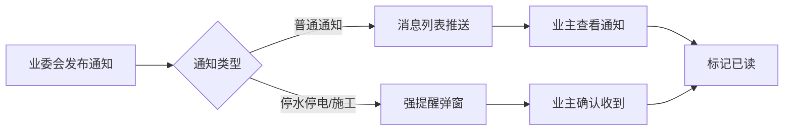
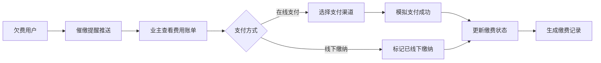
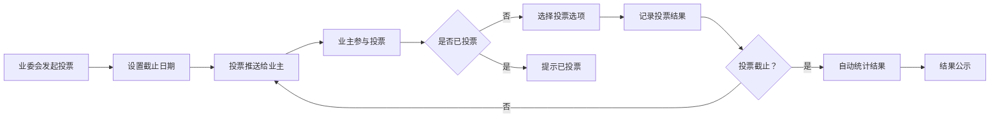
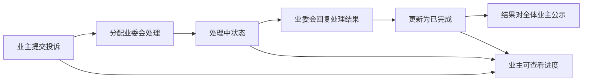

## 1. 产品概述

小区业主委员会管理平台，为业委会和业主提供数字化社区治理解决方案。解决传统小区管理中信息不透明、沟通不畅、费用收缴难、投票效率低等问题，提升社区治理效率和业主满意度。

- 核心目标：实现小区事务透明化、管理高效化、服务便民化
- 目标用户：业委会成员（管理员）、小区业主

## 2. 核心功能

### 2.1 用户角色

| 角色 | 注册方式 | 核心权限 |
|------|----------|----------|
| 业委会管理员 | 业委会认证注册 | 发布通知、管理费用、发起投票、处理投诉、公示信息 |
| 普通业主 | 扫码楼栋二维码绑定房屋 | 查看通知、缴纳物业费、参与投票、提交投诉建议 |

### 2.2 功能模块

1. **首页**：数据概览、快捷入口、最新通知轮播
2. **通知公告**：通知列表、详情查看、重要通知强提醒、扫码关注引导
3. **物业费管理**：费用查询、在线支付、欠费催缴、缴费记录
4. **维修基金**：收支流水、支出明细、审批记录、发票照片
5. **业主投票**：表决列表、投票参与、投票结果、历史记录
6. **投诉建议**：提交投诉、处理进度、结果公示、我的投诉
7. **业委会信息**：成员介绍、联系方式、职责分工

### 2.3 页面详情

| 页面名称 | 模块名称 | 功能描述 |
|----------|----------|----------|
| 首页 | 数据概览 | 显示小区总户数、已缴费户数、进行中投票、待处理投诉等关键指标 |
| 首页 | 快捷入口 | 提供各功能模块的快速导航卡片 |
| 首页 | 最新通知 | 轮播展示最新发布的3条重要通知 |
| 通知公告 | 通知列表 | 按时间倒序展示所有通知，支持按类型筛选 |
| 通知公告 | 通知详情 | 展示通知完整内容，重要通知标红高亮 |
| 通知公告 | 强提醒弹窗 | 停水停电/施工告知等重要通知强制弹窗提醒 |
| 物业费管理 | 费用查询 | 显示当前用户的应缴费用、欠费金额、缴费期限 |
| 物业费管理 | 在线支付 | 模拟在线支付流程，支持微信/支付宝支付方式选择 |
| 物业费管理 | 缴费记录 | 展示历史缴费明细，包含金额、时间、支付方式 |
| 物业费管理 | 催缴提醒 | 欠费用户显示催缴通知，支持一键跳转支付 |
| 维修基金 | 收支流水 | 按时间展示所有收支记录，总收入、总支出、结余一目了然 |
| 维修基金 | 支出详情 | 每笔支出关联审批记录、发票照片、支出说明 |
| 业主投票 | 表决列表 | 展示进行中和已结束的投票，显示截止日期倒计时 |
| 业主投票 | 投票页面 | 显示投票选项、投票说明，每户仅可投票一次 |
| 业主投票 | 结果公示 | 自动统计投票结果，展示同意/反对/弃权票数及比例 |
| 投诉建议 | 提交表单 | 支持选择投诉类型、填写内容、上传图片 |
| 投诉建议 | 进度跟踪 | 显示投诉处理状态（待处理/处理中/已完成） |
| 投诉建议 | 结果公示 | 已处理的投诉对全体业主公开可见 |
| 业委会信息 | 成员列表 | 展示业委会成员照片、姓名、职务、联系方式 |
| 业委会信息 | 职责分工 | 说明各成员分管工作范围 |

## 3. 核心流程

### 3.1 通知发布与推送流程

业委会管理员登录后发布通知，选择通知类型（普通/重要），系统自动推送给所有绑定用户，重要通知触发强制弹窗提醒。

### 3.2 物业费缴纳流程

业主登录后查看应缴费用，选择在线支付或标记线下缴纳，系统更新缴费状态，欠费用户自动收到催缴提醒。

### 3.3 业主投票流程

业委会发起表决并设置截止日期，业主参与投票（每户一票），截止后系统自动统计结果并公示。

### 3.4 投诉处理流程

业主提交投诉建议，业委会查看处理，处理结果回复业主并对全体业主公开。

## 4. 用户界面设计

### 4.1 设计风格

- **主色调**：深蓝色 #1e40af（代表专业、信任、稳重）
- **辅助色**：翠绿色 #059669（代表成功、通过）、橙红色 #dc2626（代表警告、重要通知）、暖黄色 #f59e0b（代表提醒、待办）
- **按钮风格**：圆角 8px，hover 状态有微妙阴影和颜色加深过渡
- **字体**：标题使用"Noto Serif SC"（宋体）体现正式感，正文使用"PingFang SC"（苹方）保证可读性
- **布局风格**：卡片式布局，顶部导航 + 侧边栏 + 主内容区三栏结构
- **图标风格**：使用 lucide-react 线性图标，保持简洁统一

### 4.2 页面设计概述

| 页面名称 | 模块名称 | UI 元素 |
|----------|----------|---------|
| 首页 | 数据概览 | 4个统计卡片，渐变背景，数字动画效果 |
| 首页 | 快捷入口 | 6个功能卡片，图标 + 文字，hover 上浮效果 |
| 首页 | 通知轮播 | 自动轮播，重要通知红框标识 |
| 通知公告 | 通知列表 | 标签页切换（全部/重要/已读/未读），列表项含类型标签、发布时间 |
| 通知公告 | 通知详情 | 标题醒目，正文排版整齐，附件可点击查看 |
| 物业费管理 | 费用概览 | 大号数字显示应缴/欠费金额，缴费截止倒计时 |
| 物业费管理 | 支付弹窗 | 支付方式选择，确认按钮，支付成功动画 |
| 维修基金 | 收支概览 | 三个数字卡片（收入/支出/结余），趋势箭头 |
| 维修基金 | 流水列表 | 时间线布局，收入绿色箭头向上，支出红色箭头向下 |
| 维修基金 | 支出详情 | 审批记录时间线，发票照片缩略图可放大 |
| 业主投票 | 投票列表 | 卡片展示，含截止倒计时、参与进度条 |
| 业主投票 | 投票详情 | 选项卡片，点击选中动画，提交确认弹窗 |
| 业主投票 | 结果展示 | 饼图/柱状图可视化，详细票数统计 |
| 投诉建议 | 提交表单 | 下拉选择类型，多行文本输入，图片上传 |
| 投诉建议 | 列表展示 | 状态标签（待处理/处理中/已完成）不同颜色标识 |
| 业委会信息 | 成员卡片 | 头像 + 姓名 + 职务 + 联系方式图标 |

### 4.3 响应式设计

- **桌面优先**：主内容区最小宽度 1200px，侧边栏固定宽度 240px
- **平板适配**：1024px 以下侧边栏收起为抽屉式菜单
- **手机适配**：768px 以下转为顶部标签导航，卡片单列布局，触控区域不小于 44px
- **触控优化**：所有可点击元素设置 :active 状态反馈，表单输入框高度适配触控

### 4.4 交互与动画

- **页面加载**：元素按顺序淡入，stagger 延迟 50ms
- **卡片 hover**：向上位移 4px，阴影加深，过渡时间 200ms
- **按钮点击**：缩放 0.96，过渡时间 100ms
- **重要通知弹窗**：从顶部滑入 + 轻微弹性效果
- **投票成功**：绿色对勾缩放动画，结果数字滚动效果
- **支付成功**：圆形进度条填充动画 + 成功图标弹出
