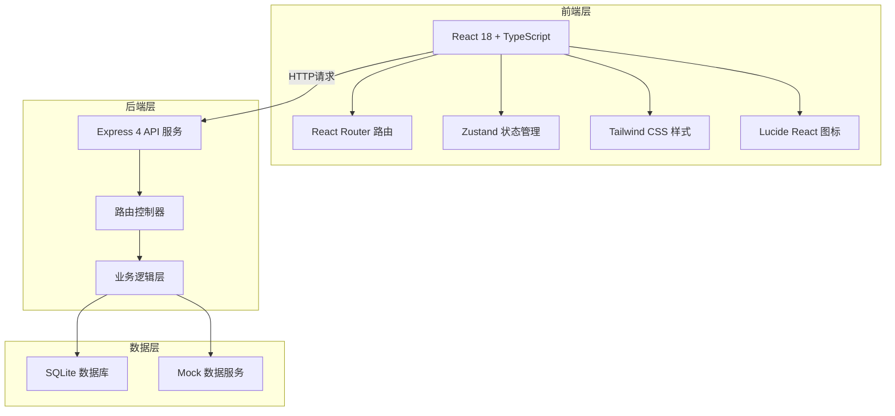
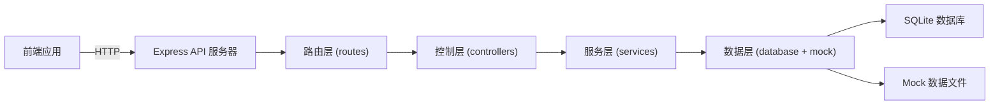
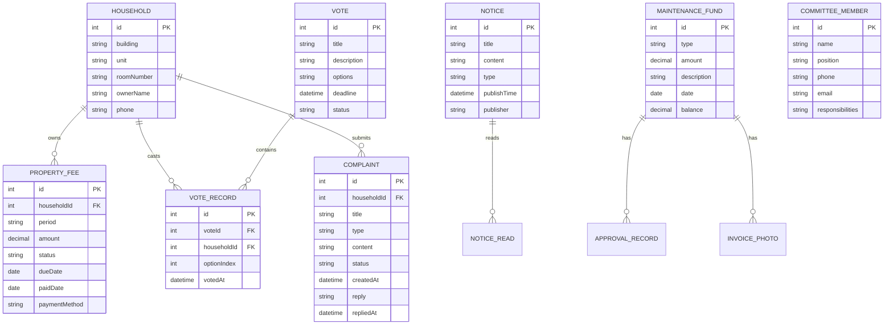

## 1. 架构设计



## 2. 技术描述

- **前端**：React@18 + TypeScript + Vite + tailwindcss@3 + react-router-dom@6 + zustand + lucide-react
- **初始化工具**：vite-init
- **后端**：Express@4 + TypeScript
- **数据库**：SQLite（本地存储）+ Mock 数据
- **数据交互**：RESTful API + fetch

## 3. 路由定义

| 路由路径 | 页面名称 | 说明 |
|----------|----------|------|
| / | 首页 | 数据概览、快捷入口、通知轮播 |
| /notices | 通知公告 | 通知列表、筛选、详情 |
| /notices/:id | 通知详情 | 单条通知完整内容 |
| /property-fee | 物业费管理 | 费用查询、支付、缴费记录 |
| /maintenance-fund | 维修基金 | 收支流水、支出详情 |
| /votes | 业主投票 | 表决列表、投票参与 |
| /votes/:id | 投票详情 | 投票选项、投票结果 |
| /complaints | 投诉建议 | 提交投诉、进度查看、结果公示 |
| /committee | 业委会信息 | 成员列表、联系方式 |
| /login | 登录页 | 业委会/业主登录选择 |

## 4. API 定义

### 4.1 通知公告 API

```typescript
// 类型定义
interface Notice {
  id: number;
  title: string;
  content: string;
  type: 'normal' | 'water' | 'power' | 'construction' | 'important';
  publishTime: string;
  publisher: string;
  isRead: boolean;
  attachments?: string[];
}

// 获取通知列表
GET /api/notices?type=&page=&pageSize=
Response: { data: Notice[], total: number }

// 获取通知详情
GET /api/notices/:id
Response: { data: Notice }

// 标记已读
PUT /api/notices/:id/read
Response: { success: boolean }

// 发布通知（管理员）
POST /api/notices
Request: { title, content, type, attachments }
Response: { success: boolean, id: number }
```

### 4.2 物业费 API

```typescript
interface PropertyFee {
  id: number;
  householdId: number;
  building: string;
  unit: string;
  roomNumber: string;
  period: string;
  amount: number;
  status: 'unpaid' | 'paid' | 'overdue';
  dueDate: string;
  paidDate?: string;
  paymentMethod?: 'online' | 'offline';
}

// 获取用户费用列表
GET /api/property-fee?householdId=
Response: { data: PropertyFee[], unpaidTotal: number }

// 在线支付
POST /api/property-fee/:id/pay
Request: { paymentMethod: 'online' | 'offline', channel?: 'wechat' | 'alipay' }
Response: { success: boolean, paidDate: string }

// 获取缴费记录
GET /api/property-fee/records?householdId=
Response: { data: PropertyFee[] }
```

### 4.3 维修基金 API

```typescript
interface MaintenanceFund {
  id: number;
  type: 'income' | 'expense';
  amount: number;
  description: string;
  date: string;
  balance: number;
  approvalRecords?: ApprovalRecord[];
  invoicePhotos?: string[];
}

interface ApprovalRecord {
  id: number;
  approver: string;
  role: string;
  comment: string;
  approvedAt: string;
  status: 'approved' | 'rejected';
}

// 获取基金流水
GET /api/maintenance-fund?page=&pageSize=
Response: { data: MaintenanceFund[], totalIncome: number, totalExpense: number, balance: number }

// 获取支出详情
GET /api/maintenance-fund/:id
Response: { data: MaintenanceFund }
```

### 4.4 投票 API

```typescript
interface Vote {
  id: number;
  title: string;
  description: string;
  options: string[];
  deadline: string;
  createdAt: string;
  status: 'ongoing' | 'ended';
  results?: number[];
  totalVotes: number;
  hasVoted: boolean;
  userVote?: number;
}

// 获取投票列表
GET /api/votes
Response: { data: Vote[] }

// 获取投票详情
GET /api/votes/:id
Response: { data: Vote }

// 提交投票
POST /api/votes/:id/vote
Request: { optionIndex: number, householdId: number }
Response: { success: boolean }
```

### 4.5 投诉建议 API

```typescript
interface Complaint {
  id: number;
  title: string;
  type: 'maintenance' | 'noise' | 'sanitation' | 'security' | 'suggestion' | 'other';
  content: string;
  images?: string[];
  status: 'pending' | 'processing' | 'completed';
  createdAt: string;
  reply?: string;
  repliedAt?: string;
  replier?: string;
  householdId: number;
}

// 提交投诉
POST /api/complaints
Request: { title, type, content, images, householdId }
Response: { success: boolean, id: number }

// 获取投诉列表
GET /api/complaints?householdId=&all=
Response: { data: Complaint[] }

// 获取投诉详情
GET /api/complaints/:id
Response: { data: Complaint }

// 回复投诉（管理员）
PUT /api/complaints/:id/reply
Request: { reply, replier }
Response: { success: boolean }
```

### 4.6 业委会信息 API

```typescript
interface CommitteeMember {
  id: number;
  name: string;
  position: string;
  avatar: string;
  phone: string;
  email: string;
  responsibilities: string[];
}

// 获取成员列表
GET /api/committee
Response: { data: CommitteeMember[] }
```

## 5. 服务器架构图



## 6. 数据模型

### 6.1 实体关系图



### 6.2 数据定义语言

```sql
-- 业主表
CREATE TABLE household (
    id INTEGER PRIMARY KEY AUTOINCREMENT,
    building VARCHAR(10) NOT NULL,
    unit VARCHAR(10) NOT NULL,
    room_number VARCHAR(10) NOT NULL,
    owner_name VARCHAR(50) NOT NULL,
    phone VARCHAR(20) NOT NULL,
    UNIQUE(building, unit, room_number)
);

-- 通知表
CREATE TABLE notice (
    id INTEGER PRIMARY KEY AUTOINCREMENT,
    title VARCHAR(200) NOT NULL,
    content TEXT NOT NULL,
    type VARCHAR(20) NOT NULL DEFAULT 'normal',
    publish_time DATETIME NOT NULL DEFAULT CURRENT_TIMESTAMP,
    publisher VARCHAR(50) NOT NULL
);

-- 物业费表
CREATE TABLE property_fee (
    id INTEGER PRIMARY KEY AUTOINCREMENT,
    household_id INTEGER NOT NULL,
    period VARCHAR(20) NOT NULL,
    amount DECIMAL(10,2) NOT NULL,
    status VARCHAR(20) NOT NULL DEFAULT 'unpaid',
    due_date DATE NOT NULL,
    paid_date DATE,
    payment_method VARCHAR(20),
    FOREIGN KEY (household_id) REFERENCES household(id)
);

-- 维修基金表
CREATE TABLE maintenance_fund (
    id INTEGER PRIMARY KEY AUTOINCREMENT,
    type VARCHAR(10) NOT NULL,
    amount DECIMAL(12,2) NOT NULL,
    description TEXT NOT NULL,
    date DATE NOT NULL,
    balance DECIMAL(12,2) NOT NULL
);

-- 审批记录表
CREATE TABLE approval_record (
    id INTEGER PRIMARY KEY AUTOINCREMENT,
    fund_id INTEGER NOT NULL,
    approver VARCHAR(50) NOT NULL,
    role VARCHAR(50) NOT NULL,
    comment TEXT,
    approved_at DATETIME NOT NULL,
    status VARCHAR(20) NOT NULL,
    FOREIGN KEY (fund_id) REFERENCES maintenance_fund(id)
);

-- 投票表
CREATE TABLE vote (
    id INTEGER PRIMARY KEY AUTOINCREMENT,
    title VARCHAR(200) NOT NULL,
    description TEXT,
    options TEXT NOT NULL,
    deadline DATETIME NOT NULL,
    status VARCHAR(20) NOT NULL DEFAULT 'ongoing',
    created_at DATETIME NOT NULL DEFAULT CURRENT_TIMESTAMP
);

-- 投票记录表
CREATE TABLE vote_record (
    id INTEGER PRIMARY KEY AUTOINCREMENT,
    vote_id INTEGER NOT NULL,
    household_id INTEGER NOT NULL,
    option_index INTEGER NOT NULL,
    voted_at DATETIME NOT NULL DEFAULT CURRENT_TIMESTAMP,
    FOREIGN KEY (vote_id) REFERENCES vote(id),
    FOREIGN KEY (household_id) REFERENCES household(id),
    UNIQUE(vote_id, household_id)
);

-- 投诉表
CREATE TABLE complaint (
    id INTEGER PRIMARY KEY AUTOINCREMENT,
    household_id INTEGER NOT NULL,
    title VARCHAR(200) NOT NULL,
    type VARCHAR(20) NOT NULL,
    content TEXT NOT NULL,
    status VARCHAR(20) NOT NULL DEFAULT 'pending',
    created_at DATETIME NOT NULL DEFAULT CURRENT_TIMESTAMP,
    reply TEXT,
    replied_at DATETIME,
    replier VARCHAR(50),
    FOREIGN KEY (household_id) REFERENCES household(id)
);

-- 业委会成员表
CREATE TABLE committee_member (
    id INTEGER PRIMARY KEY AUTOINCREMENT,
    name VARCHAR(50) NOT NULL,
    position VARCHAR(50) NOT NULL,
    avatar VARCHAR(200),
    phone VARCHAR(20) NOT NULL,
    email VARCHAR(100),
    responsibilities TEXT
);
```

### 6.3 初始化 Mock 数据

```sql
-- 初始化业主数据
INSERT INTO household (building, unit, room_number, owner_name, phone) VALUES
('1栋', '1单元', '101', '张三', '13800138001'),
('1栋', '1单元', '102', '李四', '13800138002'),
('1栋', '2单元', '201', '王五', '13800138003'),
('2栋', '1单元', '301', '赵六', '13800138004'),
('2栋', '2单元', '502', '钱七', '13800138005');

-- 初始化通知数据
INSERT INTO notice (title, content, type, publisher) VALUES
('关于小区停水通知', '因市政管道维修，1栋将于6月20日上午9:00-12:00停水，请提前做好储水准备。', 'water', '物业管理处'),
('电梯维修通知', '3栋电梯将于6月25日进行年度检修，预计停运一天。', 'construction', '业委会'),
('2024年业主大会会议通知', '兹定于2024年7月1日下午14:00在小区活动中心召开年度业主大会。', 'normal', '业委会'),
('停电通知', '因线路检修，6月22日下午14:00-18:00全小区临时停电。', 'power', '供电所');

-- 初始化物业费数据
INSERT INTO property_fee (household_id, period, amount, status, due_date) VALUES
(1, '2024-06', 256.50, 'unpaid', '2024-06-30'),
(1, '2024-05', 256.50, 'paid', '2024-05-31'),
(2, '2024-06', 312.00, 'overdue', '2024-06-10'),
(3, '2024-06', 280.80, 'unpaid', '2024-06-30'),
(4, '2024-06', 198.00, 'paid', '2024-06-15');

-- 初始化维修基金数据
INSERT INTO maintenance_fund (type, amount, description, date, balance) VALUES
('income', 500000.00, '初始维修基金', '2023-01-01', 500000.00),
('expense', 25000.00, '1栋电梯维修更换钢丝绳', '2023-06-15', 475000.00),
('expense', 12000.00, '小区监控系统升级', '2023-09-20', 463000.00),
('expense', 8500.00, '消防设施年度检测维护', '2024-03-10', 454500.00),
('income', 15000.00, '小区广告位租金收入', '2024-05-01', 469500.00);

-- 初始化投票数据
INSERT INTO vote (title, description, options, deadline, status) VALUES
('关于更换物业公司的表决', '鉴于现有物业公司服务质量下降，业委会提议更换物业公司，请各位业主投票表决。', '["同意更换", "不同意更换", "弃权"]', '2024-07-15 23:59:59', 'ongoing'),
('动用维修基金维修电梯', '3栋电梯已使用10年，需要进行重大维修，预计费用5万元。', '["同意动用", "不同意动用", "弃权"]', '2024-06-30 23:59:59', 'ongoing'),
('小区健身器材采购方案', '计划采购一批健身器材放置在活动中心旁空地处，预算2万元。', '["方案A（常规器材）", "方案B（智能器材）", "暂不采购"]', '2024-06-10 23:59:59', 'ended');

-- 初始化投票记录
INSERT INTO vote_record (vote_id, household_id, option_index) VALUES
(1, 1, 0),
(1, 2, 1),
(1, 3, 0),
(2, 1, 0),
(3, 1, 0),
(3, 2, 1),
(3, 3, 2);

-- 初始化投诉数据
INSERT INTO complaint (household_id, title, type, content, status, reply, replied_at, replier) VALUES
(1, '1栋楼道灯损坏', 'maintenance', '1栋2单元3楼楼道灯不亮已有一周，晚上回家很不方便。', 'completed', '已安排维修人员更换，感谢您的反馈。', '2024-06-15 10:30:00', '李主任'),
(2, '深夜噪音扰民', 'noise', '2栋楼下烧烤店每晚营业到凌晨3点，噪音严重影响休息。', 'processing', NULL, NULL, NULL),
(3, '建议增设垃圾分类点', 'suggestion', '目前只有大门处有一个垃圾分类点，建议在各栋楼下增设小型分类桶。', 'pending', NULL, NULL, NULL);

-- 初始化业委会成员
INSERT INTO committee_member (name, position, avatar, phone, email, responsibilities) VALUES
('王明', '主任', 'https://images.unsplash.com/photo-1472099645785-5658abf4ff4e?w=200&h=200&fit=crop&crop=face', '13900139001', 'wangming@example.com', '["主持业委会全面工作", "分管财务审批"]'),
('李华', '副主任', 'https://images.unsplash.com/photo-1438761681033-6461ffad8d80?w=200&h=200&fit=crop&crop=face', '13900139002', 'lihua@example.com', '["分管物业监督", "分管投诉处理"]'),
('张健', '委员', 'https://images.unsplash.com/photo-1500648767791-00dcc994a43e?w=200&h=200&fit=crop&crop=face', '13900139003', 'zhangjian@example.com', '["分管维修基金管理", "分管工程维修"]'),
('刘芳', '委员', 'https://images.unsplash.com/photo-1494790108377-be9c29b29330?w=200&h=200&fit=crop&crop=face', '13900139004', 'liufang@example.com', '["分管环境卫生", "分管社区活动"]'),
('陈伟', '委员', 'https://images.unsplash.com/photo-1507003211169-0a1dd7228f2d?w=200&h=200&fit=crop&crop=face', '13900139005', 'chenwei@example.com', '["分管安全保卫", "分管宣传通知"]');
```
